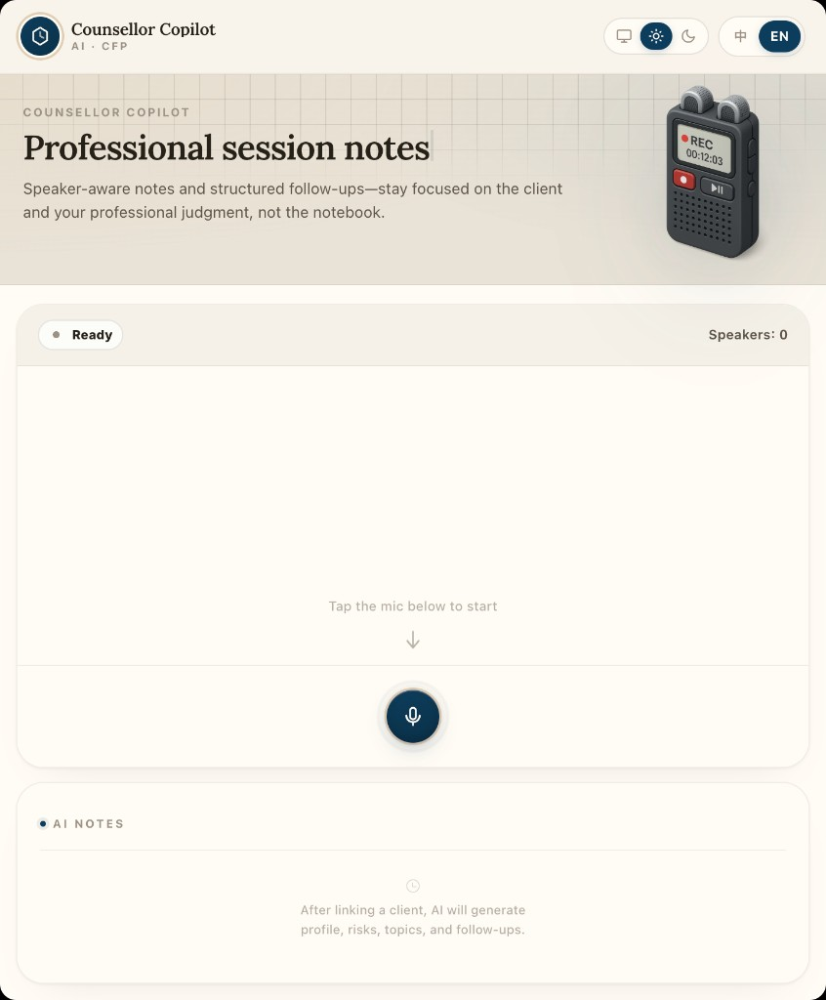

# AI Record · Counsellor Copilot

<p align="center">
  
</p>

A **Vue 3** web app for **AI-assisted financial counselling meetings**: live or demo transcript, speaker diarization, client linking, and meeting summaries. A **FastAPI** service (`diarization-service`) connects to **Volc / Doubao** streaming ASR and optional **OpenAI**-based summarization.

---

## What’s in the repo

| Area | Role |
|------|------|
| `src/` | Vue app — Live transcript, Demo scripts, voiceprint settings |
| `diarization-service/` | FastAPI API — ASR, voiceprint endpoints, summarize / entity extraction |
| `docs/launch.md` | Step-by-step local backend + frontend launch |
| `docs/demo-mode.md` | Long-form **Demo mode** UX narrative & architecture pointers (v3) |
| `.env.example` | Frontend env template → copy to **`.env.local`** |
| `diarization-service/.env.example` | Backend env template → copy to **`diarization-service/.env`** |

**Secrets:** Never commit real keys. Use `.env.local` (frontend) and `diarization-service/.env` (backend). Both are gitignored.

**Editions:** Branch **`main`** (this branch) is the personal / demo line (MiMo summaries, Tencent deploy). Company / internal use lives on **`business-edition`** with a separate gateway `.env` — run `git checkout business-edition` and read `docs/business-edition.md` there. Do not mix keys between branches.

---

## Features

- **Live mode** — Browser microphone → chunked upload → Volc ASR + incremental/final transcript; live caption + speaker bubbles; optional voiceprint-assisted speaker consistency.
- **Demo mode** — Fully mocked scripts (no mic): scripted chunks, simulated latency, CRM linking, animated summary — useful for UX demos without cloud keys.
- **Voiceprint settings** — Enroll/list/delete profiles against the backend registry (when configured).
- **Summaries & entities** — Backend routes for meeting summary and entity extraction when OpenAI (or configured provider) env vars are set.

---

## Tech stack

- **Frontend:** Vue 3, Vite 8, Tailwind CSS v4, Vant 4, animate.css  
- **Backend:** Python 3, FastAPI, Uvicorn  
- **Integrations:** Volc streaming ASR (WebSocket), OpenAI-compatible summarization (optional)

---

## Prerequisites

- **Node.js** 18+ (for `npm run dev` / `npm run build`)
- **Python** 3.11+ recommended for `diarization-service`
- Volc ASR credentials and (optional) OpenAI API key for full pipeline

---

## Environment variables (for anyone cloning this repo)

**Do not put real API keys in Git.** The repo only ships **`.env.example`** files; you copy them to **ignored** local files and fill in your own values.

### Frontend (Vite) — repo root

1. Copy the template:  
   `cp .env.example .env.local`
2. Edit **`.env.local`**. Vite only exposes variables that start with **`VITE_`** to the browser — never put Volc or OpenAI **secret** keys in a `VITE_*` var (those would ship to every user’s browser).

| Variable | Purpose |
|----------|---------|
| `VITE_DIARIZATION_API_BASE` | Base URL of the FastAPI service (e.g. `http://localhost:8090` locally, or `https://api.yourdomain.com` in production). |
| `VITE_USE_VOLC` | `true` / `false` — use the live Volc client pipeline in **Live** mode. |
| `VITE_SUMMARY_API_BASE` | Optional override if summaries hit a different host (defaults to `VITE_DIARIZATION_API_BASE`). |
| `VITE_CHUNK_MS`, `VITE_*` timing | Optional tuning; see comments in **`.env.example`**. |

All options and comments: **`.env.example`**.

### Backend (FastAPI) — `diarization-service/`

1. Copy:  
   `cp diarization-service/.env.example diarization-service/.env`
2. Edit **`diarization-service/.env`** with your real credentials (this file is **gitignored**).

| Variable | Purpose |
|----------|---------|
| `VOLC_APP_ID`, `VOLC_ACCESS_TOKEN`, `VOLC_SECRET_KEY` | Volc / Doubao ASR (required for **Live** ASR). |
| `VOLC_RESOURCE_ID`, `VOLC_WS_URL` | Model / WebSocket endpoint (defaults in `.env.example`). |
| `OPENAI_API_KEY` | Optional — summaries / entities when using OpenAI (or compatible provider). |
| `SUMMARY_PROVIDER`, `SUMMARY_MODEL`, `OPENAI_BASE_URL` | Optional summary provider configuration. |

More detail (venv quirks, run commands): **`docs/launch.md`** and **`diarization-service/README.md`**.

### Demo mode without cloud keys

Switch the app to **Demo** in the top bar: no Volc/OpenAI keys required — scripts are mocked.

---

## Local development

### 1) Frontend

```bash
npm install
cp .env.example .env.local   # optional; edit API base URL & flags
npm run dev
```

Important frontend env vars (see `.env.example`):

- `VITE_DIARIZATION_API_BASE` — default `http://localhost:8090`
- `VITE_USE_VOLC` — toggle Volc pipeline on the client when testing

### 2) Backend

See **`docs/launch.md`** for interpreter/venv notes and full env list. Short version:

```bash
cd diarization-service
python3 -m venv .venv
source .venv/bin/activate   # Windows: .venv\Scripts\activate
pip install -r requirements.txt
# Create diarization-service/.env with VOLC_* and optional OPENAI_*
set -a && source .env && set +a   # Unix; on Windows set vars manually or use dotenv
uvicorn app.main:app --host 0.0.0.0 --port 8090 --reload
```

### 3) Switch modes in the app

Use the top bar to choose **Live** (real pipeline) or **Demo** (mock). Optional **Voiceprint** screen for profile management.

---

## Production build (sanity check)

```bash
npm run build    # output in dist/
npm run preview  # local smoke-test of the built assets
```

For deployment, set `VITE_DIARIZATION_API_BASE` to your **public API origin** (including `https://`) before running `npm run build`.

---

## Deployment (high level)

Typical patterns:

1. **Split:** Static frontend on **Vercel** (or any static host) + FastAPI on **Render**, **Railway**, **Fly.io**, or a **VPS** (Tencent / Alibaba ECS, etc.). Point `VITE_DIARIZATION_API_BASE` at the API URL.
2. **Single VPS:** Nginx serves `dist/` and reverse-proxies `/api` and `/healthz` to Uvicorn on `127.0.0.1:8090`.

**Tencent Cloud (max2ai.top):** step-by-step update commands — backend, frontend, secrets, and troubleshooting — are in **[`docs/deploy-tencent.md`](docs/deploy-tencent.md)**.

Free-tier PaaS APIs may **sleep** when idle (cold start); a small paid VPS stays warm if you need always-on behaviour.

---

## API surface (backend)

| Method | Path | Purpose |
|--------|------|---------|
| GET | `/healthz` | Liveness |
| POST | `/api/process-voice-volc` | Multipart audio chunk (Volc) |
| POST | `/api/process-voice-volc-preview` | Preview caption |
| GET/POST/DELETE | `/api/voiceprint/...` | Voiceprint registry |
| POST | `/api/summarize-meeting` | Meeting summary |
| POST | `/api/extract-entities` | Entity extraction |

Details: `diarization-service/README.md` and `app/main.py`.

---

## Verification (last checked)

- `npm run build` completes successfully.
- `from app.main import app` loads in a clean venv with `requirements.txt`.

---

## Demo mode (full spec)

For the full **v3** product walkthrough, mock vs real table, and file-level architecture notes, see **`docs/demo-mode.md`**. In short: scripts live in `src/data/mockDialog.js`; flow is **idle → recording → processing → reviewing → linking → summarized**; **ClientLinker** is required before the summary in Demo.

---

## License

No license file is included; treat usage as private until you add one.
